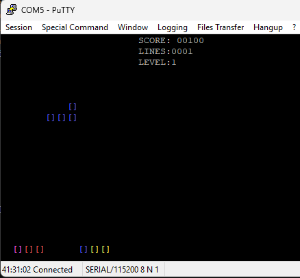

# 🏰 ROGUE 6502 + SID 6581 - Roguelike Clasico

Un juego de mazmorras procedurales estilo **Rogue/NetHack** implementado en **C89 estricto** para el procesador **6502** corriendo sobre la FPGA **Tang Nano 9K**, con efectos de sonido generados por el chip **SID 6581**.



## ✨ Caracteristicas

- 🏰 **Mazmorras procedurales**: Cada partida genera dungeons unicos con habitaciones y pasillos
- 👾 **8 tipos de monstruos**: Rata, Goblin, Esqueleto, Serpiente, Orco, Fantasma, Trol y Dragon
- ⚔️ **Sistema de combate**: Combate por turnos con dados, XP y subida de nivel
- 📜 **11 tipos de items**: Pociones, pergaminos, armas, armaduras, comida, oro y el Amuleto de Yendor
- 👁️ **Campo de vision**: Sistema de raycasting tipo Bresenham
- 🎵 **Audio SID 6581**: Efectos de sonido para combate, curacion, nivel, escaleras y victoria
- 🎮 **10 pisos de mazmorra**: La dificultad aumenta progresivamente
- 🏆 **Objetivo**: Encontrar el Amuleto de Yendor en el piso 10
- 💀 **Muerte permanente**: Como en los roguelikes clasicos

## 🕹️ Controles

| Tecla | Accion |
|-------|--------|
| **W/A/S/D** | Moverse / Atacar |
| **Q** | Tomar objeto del suelo |
| **>** | Bajar escaleras al siguiente piso |
| **ESPACIO** | Esperar un turno |
| **ESC** | Salir del juego |

## 🛠️ Especificaciones Tecnicas

### Hardware Objetivo
- **CPU**: MOS 6502 @ 3.375MHz
- **Audio**: SID 6581 ($D400)
- **Plataforma**: Tang Nano 9K FPGA
- **Display**: Terminal ANSI compatible

### Software
- **Compilador**: CC65 (`cl65`)
- **Lenguaje**: C89 estricto
- **ROM API**: `romapi.h` (proporcionada por el monitor ROM)

### Memoria
| Segmento | Direccion | Tamaño |
|----------|-----------|--------|
| Codigo | $0800-$36A9 | ~11.9 KB |
| Datos | $36AA-$3930 | ~0.6 KB |
| BSS | $3931-$3D2A | ~1.0 KB |
| Stack | $3E00-$3FFF | 512 bytes |
| **Total** | **$0800-$3DFF** | **~13.5 KB** |

## 🚀 Instalacion y Compilacion

### Requisitos
- [CC65](https://cc65.github.io/) compilador cruzado para 6502
- Make
- Conexion serial al dispositivo Tang Nano 9K

### Compilar
```bash
make clean
make
```

### Ejecutar
1. Copiar `output/rogue.bin` a la tarjeta SD
2. En el monitor:
```
LOAD rogue.bin 0800
R 0800
```

### Objetivo del juego
Explora la mazmorra, lucha contra criaturas, mejora tu personaje, y encuentra el **Amuleto de Yendor** en el piso 10 para ganar!

## 📊 Monstruos

| Nombre | Simbolo | HP | ATK | DEF | XP | Piso Min. |
|--------|---------|----|-----|-----|----|-----------|
| Rata | `r` | 5 | 2 | 0 | 3 | 1 |
| Goblin | `g` | 10 | 4 | 1 | 6 | 1 |
| Esqueleto | `E` | 18 | 6 | 2 | 12 | 2 |
| Serpiente | `s` | 12 | 5 | 2 | 8 | 3 |
| Orco | `O` | 22 | 8 | 3 | 16 | 4 |
| Fantasma | `F` | 16 | 7 | 1 | 20 | 5 |
| Trol | `T` | 30 | 10 | 4 | 25 | 7 |
| Dragon | `D` | 50 | 14 | 6 | 50 | 9 |

## 📦 Items

| Item | Simbolo | Efecto |
|------|---------|--------|
| Pocion Curacion | `!` | +10 HP |
| Pocion Fuerza | `!` | ATK+1 permanente |
| Pocion Defensa | `!` | DEF+1 permanente |
| Pergamino Mapeo | `?` | Revela el mapa |
| Pergamino Teletransp. | `?` | Teletransporta |
| Espada | `)` | ATK+2 |
| Armadura | `[` | DEF+2 |
| Anillo Proteccion | `=` | DEF+1 |
| Comida | `%` | +5 HP |
| Oro | `*` | Puntos |
| Amuleto Yendor | `"` | **VICTORIA!** |

## 🎵 Audio SID 6581

El juego utiliza el chip de sonido SID 6581 para generar efectos de audio:
- 🎯 **Hit**: Impacto contra monstruo
- 💥 **Matar**: Monstruo eliminado
- 💢 **Danio**: Jugador recibe danio
- 🎁 **Item**: Recoger objeto
- ⬆️ **Nivel**: Subir de nivel
- 🚪 **Escaleras**: Bajar de piso
- 💀 **Muerte**: Game over
- 🏆 **Victoria**: Encontrar el Amuleto

## 🎨 Colores en el mapa

| Elemento | Color |
|----------|-------|
| @ Jugador | Verde brillante |
| Monstruos | Rojo brillante |
| Items | Amarillo/Cyan |
| Paredes | Blanco brillante |
| Suelo | Gris oscuro |
| Escaleras | Amarillo |
| Recordado | Gris tenue |

## Licencia
Proyecto educativo basado en el codigo original de Tetris 6502 + SID 6581.
